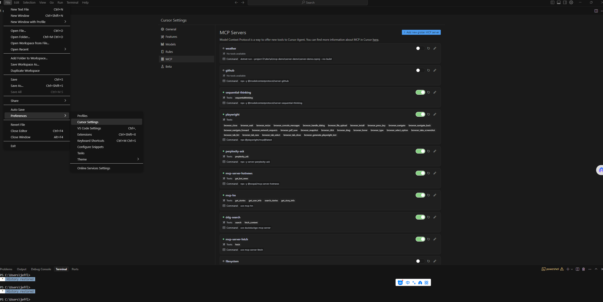
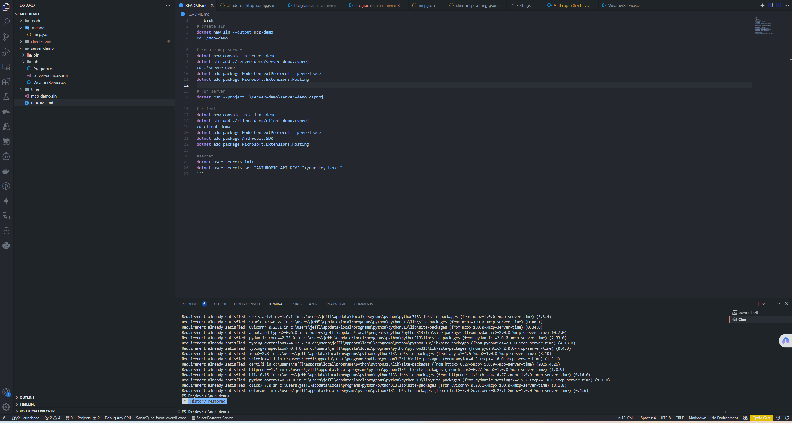
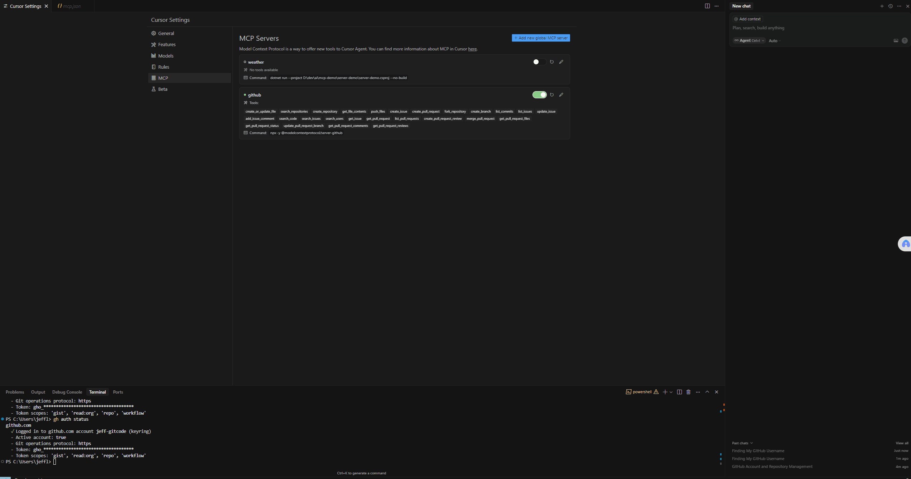
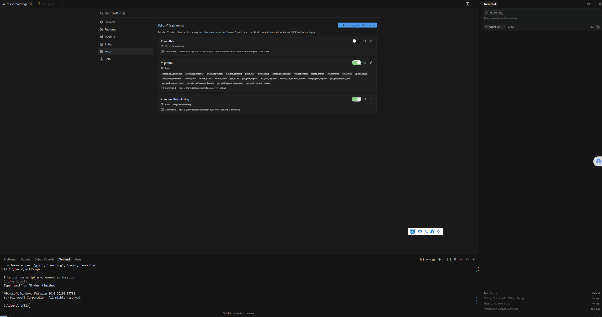

# MCP Demo

This repository demonstrates a simple setup for an MCP (Model Context Protocol) server and client using .NET.

## Setup Instructions

### Create Solution
```bash
dotnet new sln --output mcp-demo
cd ./mcp-demo
```

### Create MCP Server
```bash
dotnet new console -n server-demo
dotnet sln add ./server-demo/server-demo.csproj
cd ./server-demo
dotnet add package ModelContextProtocol --prerelease
dotnet add package Microsoft.Extensions.Hosting
```

### Run Server
```bash
dotnet run --project ./server-demo/server-demo.csproj
```

### Create MCP Client
```bash
dotnet new console -n client-demo
dotnet sln add ./client-demo/client-demo.csproj
cd client-demo
dotnet add package ModelContextProtocol --prerelease
dotnet add package Anthropic.SDK
dotnet add package Microsoft.Extensions.Hosting
```

### Configure Secrets
```bash
dotnet user-secrets init
dotnet user-secrets set "ANTHROPIC_API_KEY" "<your key here>"
```

## Project Structure
```
mcp-demo/
├── .gitignore
├── .vscode/
│   └── mcp.json
├── client-demo/
│   ├── AnthropicClient.cs
│   ├── client-demo.csproj
│   ├── bin/
│   └── obj/
├── server-demo/
│   ├── WeatherService.cs
│   ├── server-demo.csproj
│   ├── bin/
│   └── obj/
├── mcp-demo.sln
└── README.md
```

## Setup MCP server and Test in Cursor



ctrl+i to open the chat window

## Weather MCP demo


## Github MCP demo in Cursor


## Sequential Thinking MCP demo


## Hot News MCP demo


## A Stock Share MCP demo


## Test 
```bash
cd ./server-demo
npx @modelcontextprotocol/inspector dotnet run

Need to install the following packages:
@modelcontextprotocol/inspector@0.11.0

```
## Notes
- Ensure you have the `.NET SDK` installed.
- Replace `<your key here>` with your actual API key for Anthropic.